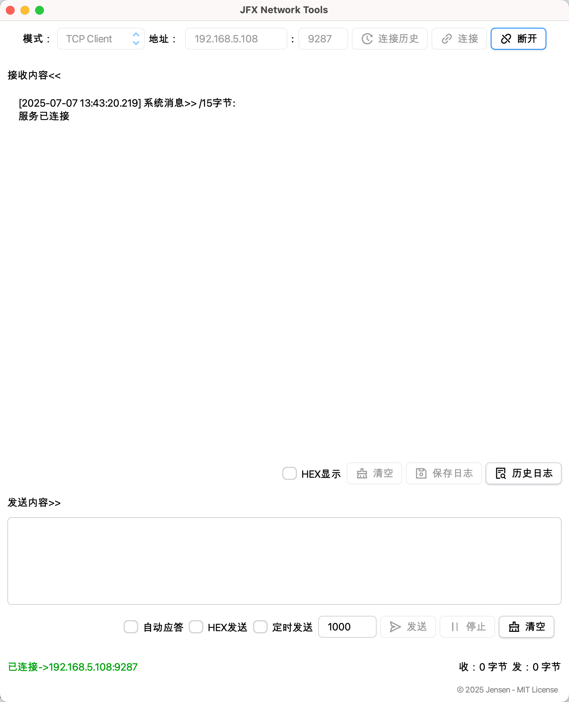
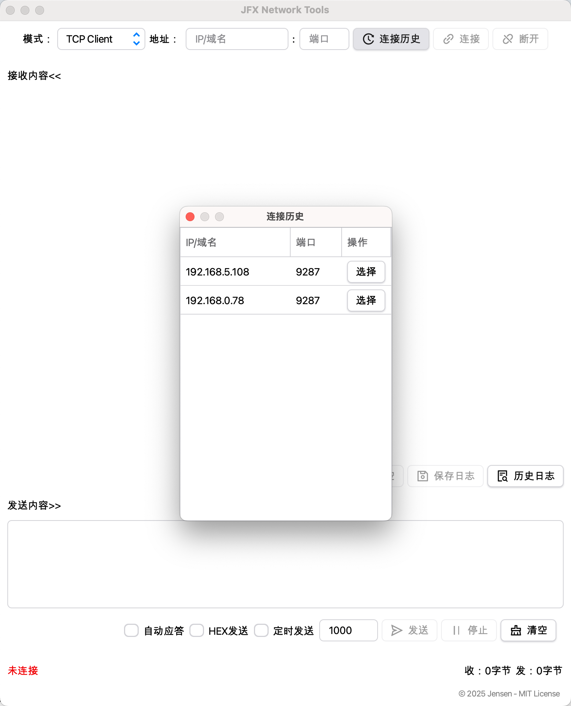
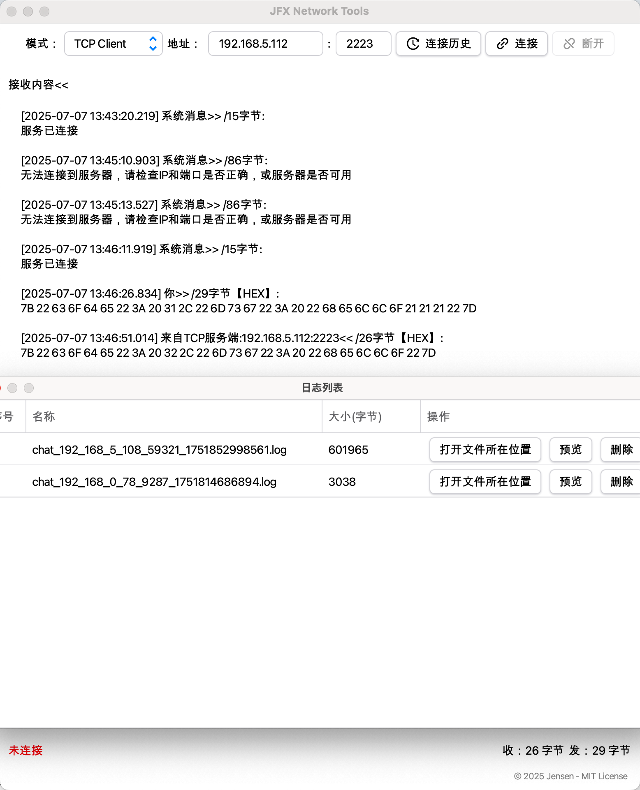
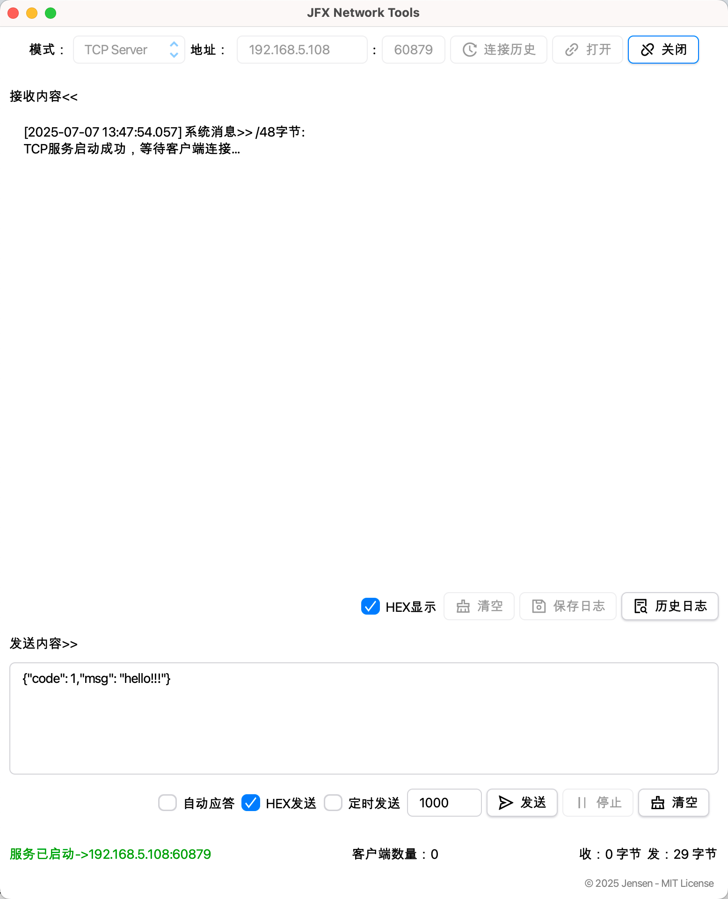
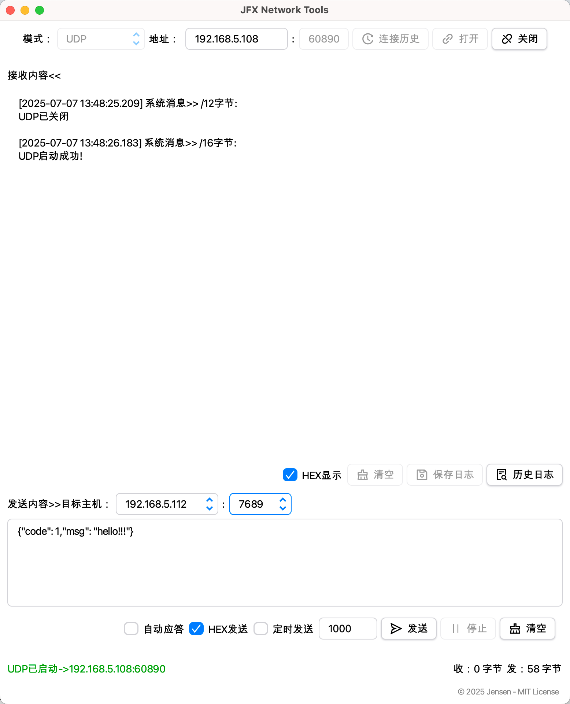
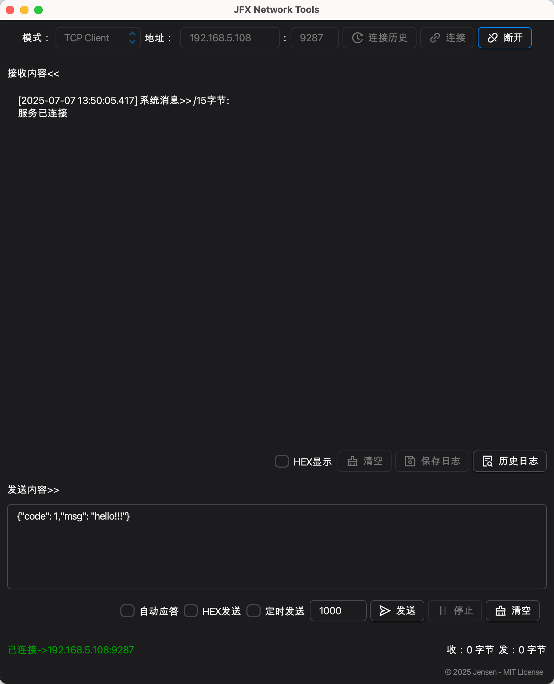
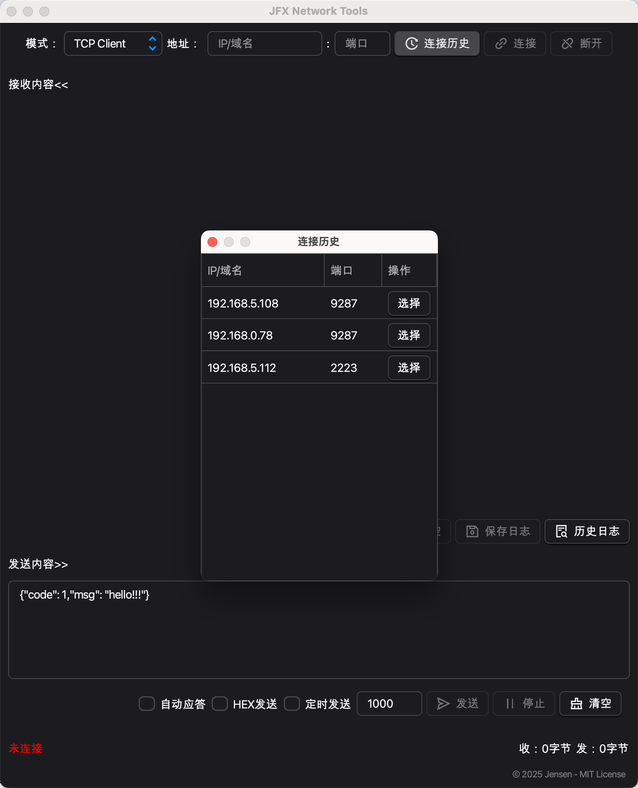
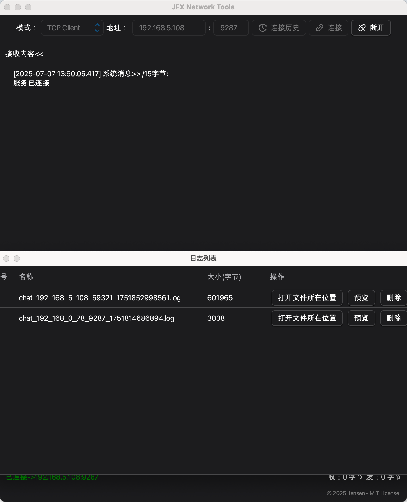
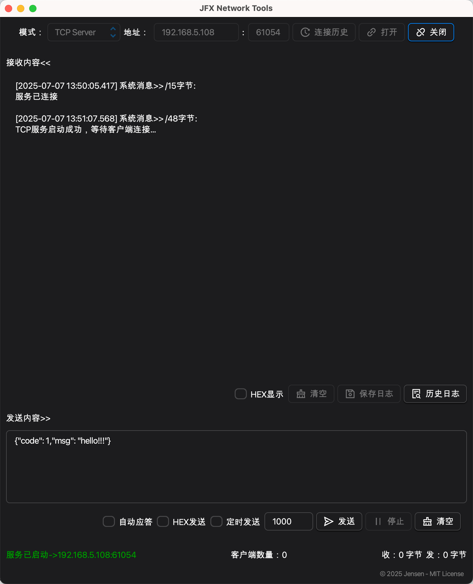
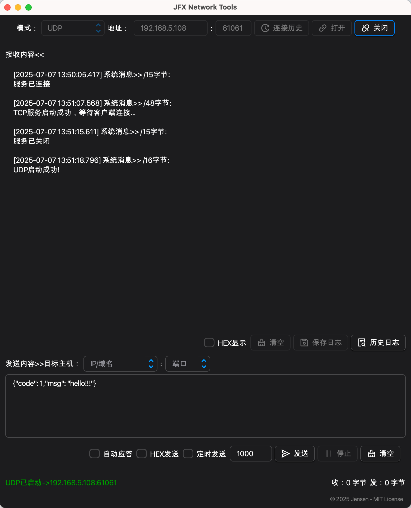

# 🛠️ JFX Network Tools

**JFX Network Tools** is a network debugging tool for macOS (based on JavaFX), supporting TCP/UDP client and server modes. It has a clear interface and is suitable for scenarios such as network protocol debugging, IoT device testing, teaching demonstrations, and rapid prototyping.

---

## ⭐ Features

| Feature                        | Description                                                 |
|-------------------------------|-------------------------------------------------------------|
| ✅ **TCP/UDP Client & Server** | Dual-mode support, easy to switch between modes             |
| 🔄 **Auto Response**           | Suitable for simulation servers (fixed response, consider developing custom response content later) |
| 📜 **Connection History**       | Quickly reuse previously connected configurations           |
| 🗄 **Log Saving**              | Support saving data as logs for easy preview and analysis  |
| 🌙 **Dark/Light Theme**        | Auto theme switching with OS compatibility                  |
| 🗂 **Scheduled Send**          | Support one-key scheduled sending, simulate heartbeat data    |

---

## 📸 Screenshots

### ☀️ Light Theme

### 🌛 Dark Theme

---

## 🚀 Installation & Usage

### 1. Development Requirements

- Java 17+
- JavaFX 17.0.6 (bundled)
- Use Maven profiles to start the app locally

---

## 📁 Data Storage

✅ The application automatically creates a data folder in the user directory:

- macOS: `~/Library/Application Support/JFXNetworkTools/`
- Windows: `%LOCALAPPDATA%\JFXNetworkTools\`

This folder is persistent and won't be deleted when uninstalling the app.

---

## 🤝 License

This project is licensed under the **MIT License**. See [LICENSE](./LICENSE) for details. Feel free to submit **issues, suggestions, or bug reports** to help us improve!

---

## 📦 Contributions

- 🌱 Feature requests are welcome
- 🐛 Please include logs and steps when reporting bugs

---

