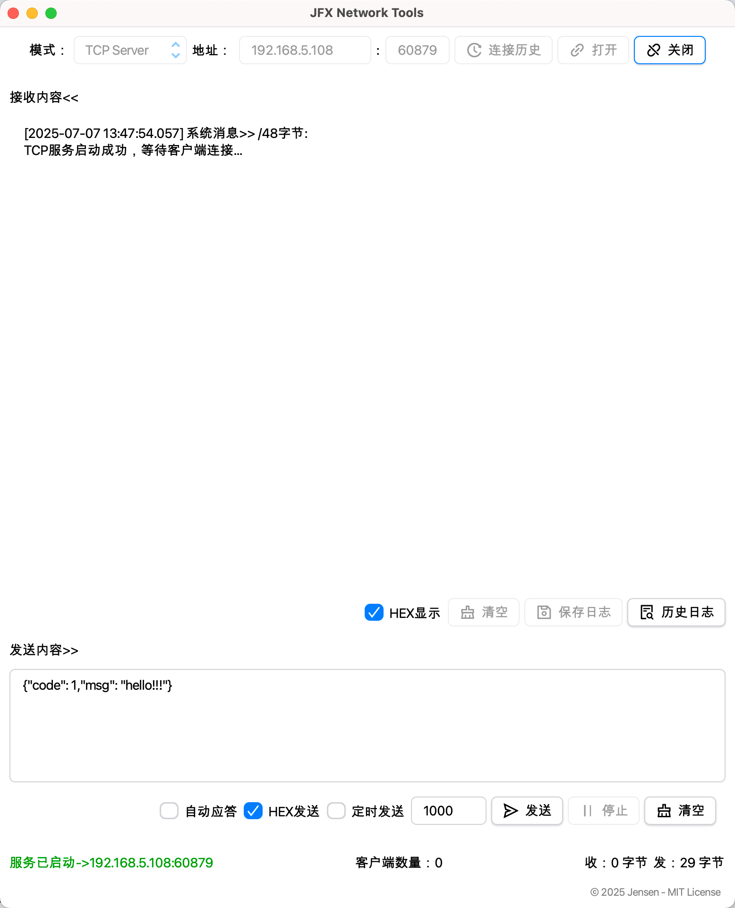
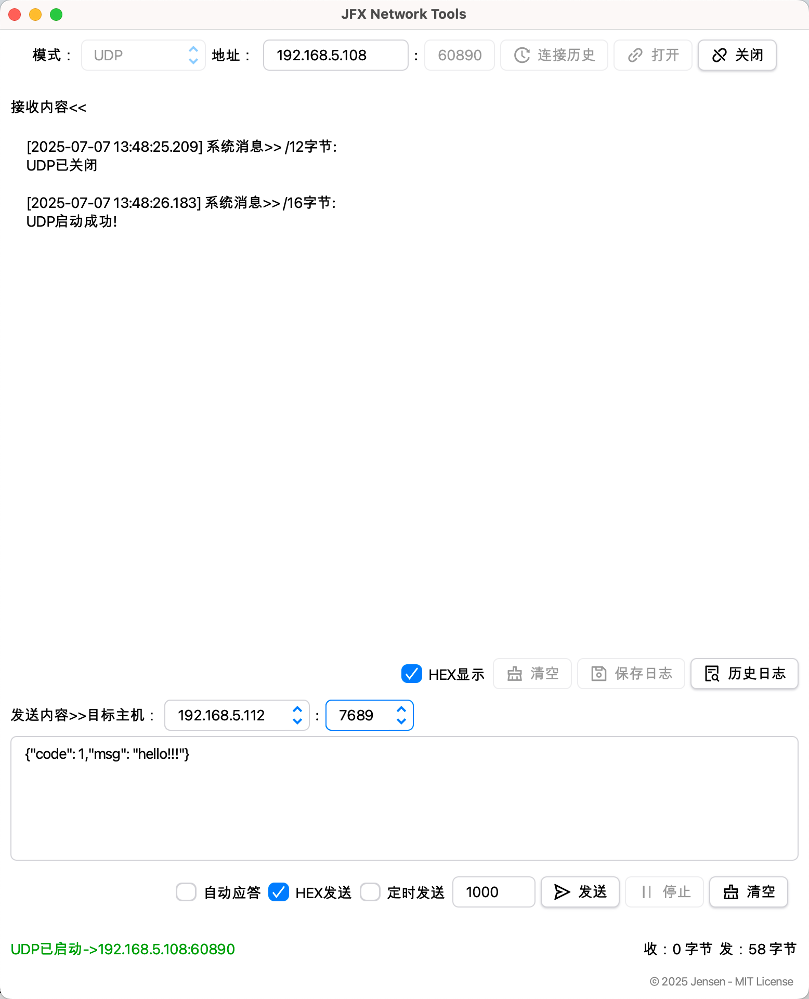
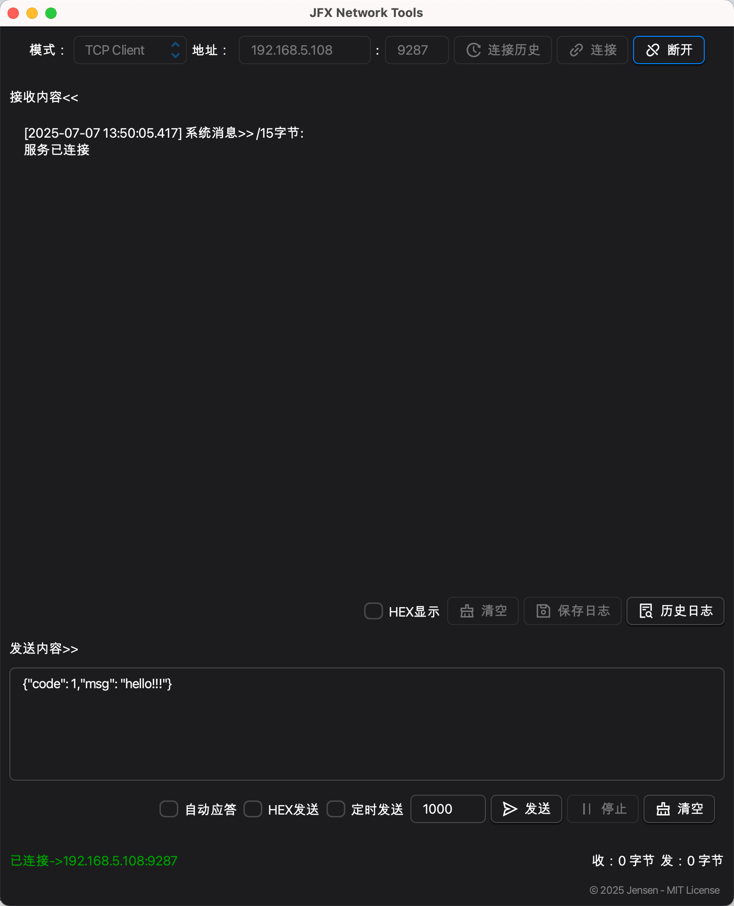
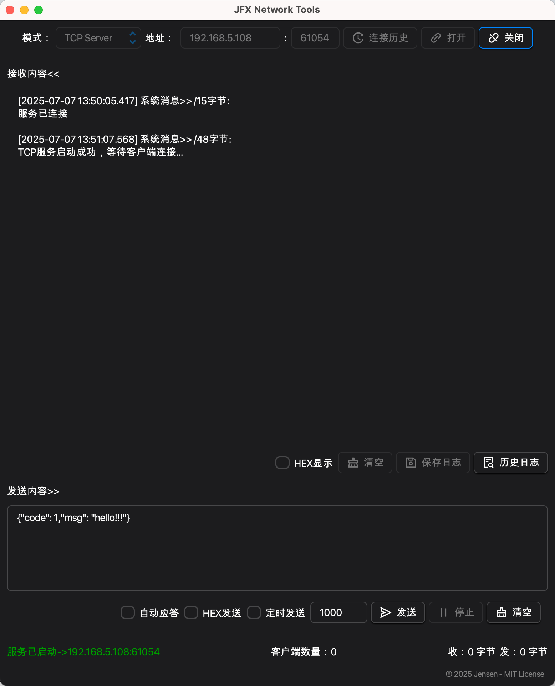

# 🛠️ JFX Network Tools

&#x20;&#x20;

**JFX Network Tools** 是一款轻量、简易、跨平台的 JavaFX 网络调试工具，支持 TCP/UDP 客户端与服务端模式。界面清晰，适用于网络协议调试、IoT 设备测试、教学演示、快速原型开发等场景。

---

## ⭐ 功能亮点

| 功能                      | 说明                          |
|-------------------------|-----------------------------|
| ✅ **TCP/UDP 客户端 & 服务端** | 双模式支持，便捷切换                  |
| 🔄 **自动应答**             | 适合模拟服务器（固定响应，后续考虑开发自定义响应内容） |
| 📜 **连接历史记录**           | 快速复用历史配置                    |
| 🗄 **日志保存**             | 支持将数据保存为日志，方便预览、分析          |
| 🌙 **深色/浅色主题**          | 自动切换，兼容操作系统                 |
| 🗂 **定时发送**             | 支持一键定时发送，模拟心跳数据             |

---

## 📸 软件截图
### ☀️浅色主题

### 🌛深色主题

---

## 🚀 安装与使用

### 1. 开发环境要求

- Java 17+
- JavaFX 17.0.6（已集成）
- 本地根据Maven Profiles启动

## 📁 数据文件存储

✅ 应用会自动创建数据文件于用户目录下：

- macOS: `~/Library/Application Support/JFXNetworkTools/`
- Windows: `%LOCALAPPDATA%\JFXNetworkTools\`

数据目录不会随 `.app` 删除，支持持久配置与历史记录。

---

## 🤝 开源协议

本项目采用 **MIT License**，详见 [LICENSE](./LICENSE)。 欢迎提交 **Issue、建议或 bug 报告**，共建更好网络调试工具！

---

## 📦 贡献与支持

- 🌱 欢迎提出功能建议
- 🐛 Bug 报告请附完整日志与复现步骤

---

